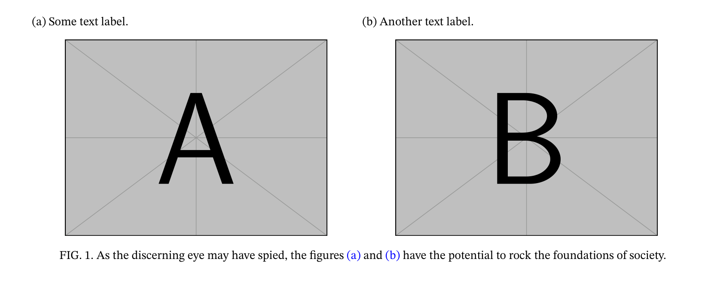
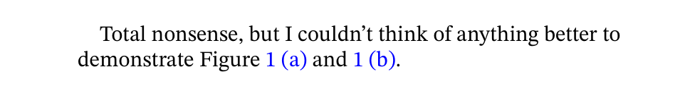

# A Poor Man's Subfigure for REVTeX

A subfigure package that works with REVTeX. See also [my blog
post](https://protagon.space/2025/02/subfigures-in-revtex/) on the
matter.

## Installation

To use, simply put the
`.sty` file somewhere where `TeX` will find it, such as next to you
`.tex` file.

## Usage

```TeX
\begin{figure*}
  \begin{multifig}
    \begin{subfigure}{\columnwidth}{\label{subfig:descriptive-label}Some
        text label.}
      \begin{center}
        \includegraphics[width=.8\columnwidth]{example-image-a}
      \end{center}
    \end{subfigure}
    \begin{subfigure}{\columnwidth}{\label{subfig:another-descriptive-label}Another
        text label.}
      \begin{center}
        \includegraphics[width=.8\columnwidth]{example-image-b}
      \end{center}
    \end{subfigure}
  \end{multifig}
  \caption{\label{fig:beautiful-figures}As the discerning eye may have
    spied, the figures \subref{subfig:descriptive-label} and
    \subref{subfig:another-descriptive-label} have the potential to
    rock the foundations of society.}
\end{figure*}
Total nonsense, but I couldn't think of anything better to demonstrate
Figure \ref{subfig:descriptive-label} and \ref{subfig:another-descriptive-label}.

```

This produces the below result...

 … and references in the text look like
